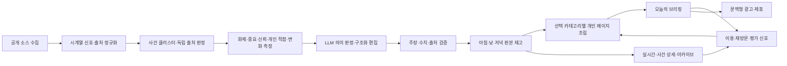

# NOWHOT-SYSTEM-BLUEPRINT-003

## 상태와 경계

- 기준 헌장: `NOWHOT-PRODUCT-CHARTER-001`
- 벤치마크 입력: `NOWHOT-BENCHMARK-DIRECTION-002`
- 선별·편집 엔진: `NOWHOT-SELECTION-EDITORIAL-001`
- 현재 변경: `DEVCHG-NOWHOT-20260813-077`
- 현재 상태: NH76 서빙 구조 PASS(무효 카테고리 400·동시 요청 격리·판 ID 슬롯 앵커·폴백 화면 고지·분야별 부분 서빙) / 편집 가치 HOLD(사건 생명주기·헤드라인 편집·다축 선별 미완) / 사람 평가 HOLD
- 개정: v4 (2026-08-13 개선 방향 — 아래 개정 섹션이 이전 서술과 충돌하면 v4가 우선)
- 대상 환경: `/Users/hyundonghwang/Documents/NowHot-Local-Dev`
- 운영 반영: 없음

이 문서는 영구 사명을 실제 제품 구조로 번역한다. 화면과 기술은 검증 결과에 따라
버전업할 수 있지만, 변경 시 헌장 원칙과 안정 ID별 영향 대조가 필요하다.

## 기준 조합

- Techmeme: 이슈 클러스터와 높은 정보 밀도
- Google Trends: 상승 근거, 시작 시각, 활성 상태
- 뉴닉·Axios: 짧은 자체 해설 문법
- Ground News·Particle: 다중 출처 상세와 출처 투명성
- 네이버 뉴스: 한국 사용자에게 익숙한 탭·순위·시간 표기

어느 하나를 복제하지 않는다. 지금핫의 공개 반응 데이터와 한국어 사용 상황에 맞는
요소만 가져온다.

## 전체 구조



## 정보 구조

| 경로 | 역할 | 색인 | 핵심 수용 조건 |
|---|---|---|---|
| `/` | 최신 개인 브리핑 판본 | index | 선택 카테고리의 국내외 필수·화제·유용 정보를 고정 개수 없이 한 페이지에 완결 |
| `/live` | 같은 셸의 실시간 모드 | noindex | 홈 복귀, 개인화·필터·읽던 위치를 보존 |
| `/story/:clusterId` | 사건 단위 상세 | 조건부 index | 타임라인·측정 근거·출처·해설·관전을 한곳에 제공 |
| `/briefing` | 판본 아카이브 | index | 날짜와 아침·낮·저녁 판본을 탐색하되 오늘 본문을 복제하지 않음 |
| `/briefing/YYYY-MM-DD` | 하루 판본 색인 | index | 해당 날짜의 세 판과 수정 이력을 제공 |
| `/briefing/YYYY-MM-DD/:edition` | 검증된 개별 판본 | index | 발행 당시 근거·구성·이전 판과의 차이를 고정 |
| `/report` | 방법론·데이터 리포트 | index | 측정 정의와 한계를 구체적으로 공개 |

## 공통 셸

- 모든 화면에 `지금핫` 브랜드와 `오늘·실시간·관심 분야·저장` 주 내비게이션을 둔다.
- 브랜드는 항상 `/`로 이동한다.
- 현재 모드는 시각적으로 명확히 표시한다.
- 현재 판본, 마지막 검증 시각, 선택 카테고리와 다음 판 상태를 표시한다.
- 상세에서 `뒤로`는 직전 목록·필터·스크롤 위치를 복원하고 `홈`은 `/`로 이동한다.
- 서버 페이지와 실시간 앱이 서로 다른 제품처럼 보이지 않도록 헤더, 폭, 타이포,
  상태 표시 규칙을 공유한다.

## 첫 화면 도면

### 데스크톱

```text
[지금핫] [오늘] [실시간] [관심 분야] [저장]   [낮판 · 검증 시각]
----------------------------------------------------------------
내가 고른 분야의 필수 브리핑                 지금 급상승
이슈 행: 무슨 일·왜 중요·왜 뜨나·변화·근거  상승 사건·속도·출처 폭
이슈 행: 무슨 일·왜 중요·왜 뜨나·변화·근거  상승 사건·속도·출처 폭
이슈 행: 무슨 일·왜 중요·왜 뜨나·변화·근거  상승 사건·속도·출처 폭
----------------------------------------------------------------
선택 분야별 주요 소식 / 이전 판 이후 변화 / 전체 필수 / 판본 아카이브
```

고정된 `상위 3~5개` 수용 조건을 두지 않는다. 첫 900px에는 자세한 핵심 행과
실시간 상승을 함께 보여 정보 밀도를 확보하고, 다음 섹션의 시작이 보여야 한다.
장식용 대형 히어로와 기능 설명 카드는 두지 않는다.

### 모바일

```text
[지금핫]             [검색] [메뉴]
[오늘] [실시간] [관심 분야] [저장]
낮판 · 마지막 검증 · 선택 분야
--------------------------------
첫 핵심 사건 전체
다음 핵심 사건의 제목·요약
--------------------------------
선택 분야의 나머지 사건이 한 페이지로 계속 이어짐
```

고정 요소가 본문을 가리지 않아야 하고, 가장 긴 한국어 제목에서도 가로 넘침이 없어야
한다. 필수 내용을 `더보기`나 별도 페이지 뒤에 숨기지 않는다.

### 동적 분량 계약

- 선택 분야마다 품질을 통과한 중요도 상위 이슈를 최대 14건까지 선별하므로 선택 분야가 늘면 유효 공급량만큼 판본도 늘어난다.
- 여러 분야를 선택하면 각 분야의 선별 목록을 합치고 동일 사건은 한 번만 남긴다.
- 최종 순서는 각 분야의 1위층, 2위층 순으로 합치며 같은 층에서는 전체 중요도가 높은 이슈를 먼저 둔다.
- 선택하지 않은 카테고리는 일반 지면에 자동 혼합하지 않는다.
- 선택 밖의 중대 사건은 `전체 필수` 레인에 분리하고 포함 이유를 표시한다.
- 후보가 적은 날에는 관련 없는 글이나 품질 미달 글로 분량을 채우지 않는다.

## 사건 클러스터 계약

| 필드 | 역할 | 필수 |
|---|---|---|
| `clusterId` | 페이지 전체가 공유하는 사건 안정 ID | 예 |
| `categoryIds` | 복수 선택 분야와 세부 주제 | 예 |
| `editionIds` | 포함된 아침·낮·저녁 판본 ID | 예 |
| `headline` | 사실과 의미를 함께 담은 지금핫 제목 | 예 |
| `whatHappened` | 교차 확인된 사실 한 문장 | 예 |
| `whyImportant` | 놓치면 잃는 판단·맥락·활용 가치 | 예 |
| `whyHot` | 반응이 지금 커진 측정 근거 한 문장 | 예 |
| `whyForYou` | 선택 카테고리·세부 주제와의 연결 근거 | 예 |
| `changedSincePrevious` | 이전 판 이후 달라진 사실·수치·상태 | 예 |
| `scorecard` | 화제·중요·신뢰·개인 적합·변화 축과 근거 | 예 |
| `metrics` | 독립 출처·플랫폼·반응·속도·가속도·시각 | 예 |
| `sourceEvidence` | 원문 URL·매체·발행 시각·원출처·근거 역할 | 예 |
| `watchNext` | 아직 확정되지 않은 다음 확인점 | 조건부 |
| `confidence` | 근거 충족 상태와 미확인 사유 | 예 |
| `publishedAt` | 처음 공개한 시각 | 예 |
| `updatedAt` | 근거 또는 해설이 마지막으로 바뀐 시각 | 예 |
| `corrections` | 수정 전후·사유·시각 | 조건부 |

홈·실시간·상세·아카이브는 같은 클러스터를 서로 다른 깊이로 투영한다. 페이지마다
해설을 다시 생성하지 않는다.

## 해설 문법

1. `무슨 일`: 두 곳 이상에서 확인된 사건의 현재 사실
2. `왜 중요한가`: 놓치면 잃는 판단·맥락·활용 가치
3. `왜 뜨나`: 평소 대비 반응량·증가 속도·독립 출처 확산의 실제 측정 근거
4. `왜 내게`: 명시적으로 선택한 카테고리·세부 주제와의 연결
5. `달라진 점`: 이전 판 이후 새로 확인된 사실·수치·상태
6. `관전`: 아직 일어나지 않았거나 확인되지 않은 다음 체크포인트

출처 하나뿐인 사건은 핵심 브리핑으로 자동 승격하지 않는다. 예외는 공식 발표처럼
단일 1차 출처가 사건 자체인 경우이며, 그 사실을 표시한다.

## 선별·편집·LLM 경계

상세 계약은 `NOWHOT-SELECTION-EDITORIAL-001`을 따른다.

- 코드는 댓글·클릭·공유·언급·속도·독립 출처를 측정하고 정규화한다.
- LLM은 검증 가능한 근거 묶음 안에서 분류·의미 판정·한국어 편집을 수행한다.
- 별도 검증 단계가 LLM의 주장과 수치·출처를 대조한다.
- 출처 신뢰도는 레지스트리의 관측 근거로 판정하고 LLM 인상으로 만들지 않는다.
- 정렬된 선택 카테고리 조합별 판본 재고를 먼저 생성하고 같은 조합의 사용자가
  공유한다. 사용자마다 전체 브리핑을 다시 생성하지 않는다.
- 모델·수집·검증 실패 시 마지막 검증 판본과 결정론적 피드로 폴백한다.

## 하루 세 판

- `morning` 07:00 KST: 밤사이 핵심 변화와 오늘의 관전
- `lunch` 12:00 KST: 오전 이후 새 사건과 중요 변화 (`midday`는 요청 별칭)
- `evening` 19:00 KST: 오늘의 결론, 놓친 핵심, 다음 관전

같은 사건은 실질적인 변화가 있을 때만 다시 등장한다. 각 판은 발행 시각을 후보
시간창의 as-of로 사용하고, 근거 스냅샷과 이전 판 차이를 보존한다. 로컬 구현 계약은
`NOWHOT-EDITORIAL-INVENTORY-CONTRACT-001`을 따른다.

슬롯별 저장 여부와 실제 시간 경과 실행은 분리한다. 날짜·슬롯별 최초 시스템 시계
관측, 지연, 당시 재고, 발행 상태와 내용 지문은
`NOWHOT-ELAPSED-EDITION-EVIDENCE-CONTRACT-001`에 따라 덮어쓰지 않고 보존한다.

## 수익 구조

- 편집 대상과 광고 대상 선정은 분리한다.
- 광고는 핵심 이슈를 읽기 전에 화면을 막지 않는다.
- `광고`, `쿠팡 파트너스 활동` 등 네트워크별 고지를 명확히 표시한다.
- 심사 모드는 한 네트워크만 사용하고 실시간 피드는 별도 정책을 유지한다.
- 광고 수익은 서버 측 자체 노출·클릭과 광고 콘솔 정산을 구분한다.
- 수익 최적화는 재방문·이탈·기여이익과 함께 판단한다.

## 장애와 복구

- 마지막 성공 수집 시각과 현재 수집 상태를 사용자·관리자에 표시한다.
- 일부 소스 장애는 전체 발행을 멈추지 않되, 출처 다양성 기준을 못 채운 클러스터는
  핵심 브리핑에서 내린다.
- 새 브리핑 생성 실패 시 마지막 검증 판본을 제공하고 오래된 정보임을 표시한다.
- DB 스키마와 발행 포맷 변경은 이전 판본을 읽을 수 있는 마이그레이션·롤백을 가진다.
- 배포는 로컬 실데이터, 전체 테스트, 데스크톱·모바일 시각 검수 뒤 한 번의 묶음으로
  진행한다.

## 개발 단계

| 단계 | 내용 | 진입 조건 | 현재 |
|---|---|---|---|
| B0 | 영구 제품헌장 | 사명·약속·비목표 초안 | 정본 유지 |
| B1 | 시스템 블루프린트 | 정보 구조·클러스터 계약·장애 원칙 | 정본 유지 |
| B1.5 | 선별·편집 엔진 | 다축 점수·검증·세 판·동적 분량 계약 | 로컬 구현·기계 검증 |
| B2 | 실데이터 와이어프레임 | 기존 브리핑을 충분한 개인판으로 확장 | 기존 구현 완료·현재 실행 검증 별도 |
| B3 | 공통 셸·통합 홈 구현 | 오늘·실시간 왕복과 모바일 밀도 | 로컬 구현 완료 |
| B4 | 클러스터 파이프라인 | 사건 결합·중복 억제·근거 계보 | 독립 AI 84/84 완료·과거 패킷 HOLD·미래 판 수리 |
| B5 | 로컬 릴리스 후보 | 독자 문장·분야 공급·정상 서빙 | 로컬 실사용 진입 PASS·다일/실이용자 검증 대기 |
| B6 | 운영 전환 | David 배포 승인·롤백 영수증 | 금지 |

## 2026-08-12~13 실사용 진입 게이트

초기 단계표를 최신 개발 원장 `NH75 / DEVCHG-NOWHOT-20260813-070`과 맞췄다.
과거 문서 영수증과 현재 런타임을 구분해 새 불변 패킷부터 네 단계를 다시 검증했다.
각 단계는 구현·표적 테스트·별도 적대적 독립검수까지 완료했다.

| 순서 | 안정 ID | 완료 조건 | 현재 |
|---|---|---|---|
| 1 | NH70-REVIEW-PACKET-PERSISTENCE | 같은 42행을 영구 저장하고 재시작 뒤 같은 패킷·지문을 복원 | PASS · `BRP-07rqta4` · 42행 · 재시작 동일 |
| 2 | NH71-INDEPENDENT-EDITORIAL-REVIEW | 독립 AI 검수 A·B가 상대 답을 보지 않고 각각 42행을 완료하고 불일치만 조정 | PASS · 84/84 · 11행/16필드 조정 · 과거 패킷 4 PASS/38 HOLD |
| 3 | NH72-DEFAULT-SUPPLY-RECOVERY | 유머를 포함한 기본 조합과 부족 분야를 품질 미달 채우기 없이 충족 | PASS · 기본 4/4·28건 · 전체 14/14·42건 · v21 |
| 4 | NH73-DEFAULT-TODAY-SERVEABLE | 재시작 뒤 기본 `/api/today`가 검증된 브리핑을 HTTP 200으로 제공 | PASS · HTTP 200 · 재시작 동일 · LAN/390px 정상 |
| 정정 | NH74-CATEGORY-COMBINATION-SERVEABILITY | 선택 수·조합이 달라도 공급 충족 판을 반복 문장 오탐 없이 제공 | PASS · 단일 14/14 · 두 분야 91/91 · 3~14개 층화 34/34 |
| 정정 | NH75-ADDITIVE-CATEGORY-UNION | 각 선택 분야의 상위 이슈를 합치고 같은 사건은 한 번만, 분야별 중요도 순위 층으로 혼합 | PASS · 경제+과학 28건 · 14/14 · 고유 사건 28/28 · 390px 정상 |

각 순서는 구현·표적 테스트·별도 적대적 독립검수의 세 증거가 모두 PASS일 때만
다음으로 이동한다. 외부 LLM 확대, 새 기능, 운영 배포는 이 실행 범위에 포함하지 않는다.

NH70 실행 영수증은 파일 저장 로컬 서버에서 생성한 `BRP-07rqta4`다. 정렬한 42행
SHA-256은 `c36eafd025502366ef6f287298f3d7c8e334e0e59a1f9827800204d6c970f6bd`,
재시작 전후 패킷·판본·행 대조 지문은
`d4ccdf4726e990a1bd211a380a74a440d1ebc3d5cd56271c6e04046c22ad80cb`로 같았다.
정시 canonical 판본 변경과 외부 LLM 호출은 모두 0이다.

NH71은 동일한 42행을 두 독립 AI 검수자에게 분리 제공해 84/84 판정을 완료했다.
11행 16필드의 의견 차이만 세 번째 독립 조정으로 닫았다. 동결된 과거 패킷은
`human_quality_hold` 38행, 통과 4행으로 그대로 보존했고, 확인된 문체·제목·중요성·
변화 설명 결함은 미래 생성 판에만 최소 수리했다. 실제 사람 검수나 사람 신원 확인을
뜻하지 않으며 제품 런타임 LLM 호출은 0이다.

NH72는 새 소스를 늘리지 않고 후보 선택 순서만 바로잡았다. 개인 오늘판에서 한국어로
읽을 수 있는 유효 후보를 분야 최소치에 먼저 쓰고 나머지는 기존 순위로 복원한다.
기본 조합은 4/4·28건, 전체 선택은 14/14·42건이며 NH72 당시 계약 재고는 `v21`이다.
현재 시각에 품질 HOLD인 부분 재고는 저장하지 않고, 구버전 `v17·v18·v20`은 보존했다.

NH73 기본판은 판본 `2026-08-12-lunch-business.humor.news.tech`, 패킷
`BRP-1657l0y`, 28건, HTTP 200이다. 재시작 전후 응답 SHA-256
`696bbff505899752fa4599032c903ee48e5a1fd3848069e6eca005545850c362`와 이슈 지문
`30f5aec67a553dcaeb6ffef198292b016404fd7ea6d9aea22739d8814fbf4190`가 같았다.
같은 Wi-Fi의 LAN 응답과 390px 모바일 레이아웃도 정상이며, 최종 독립 AI 검수는
원시 파일·파싱 대조 뒤 PASS했다. 전체 회귀는 1,138/1,138 PASS다.

NH74는 실사용 중 발견된 조합별 409를 정정한다. 원문 공급과 분야 최소치는
충족했지만 사건명이 빠진 자동 중요성·지금 이유·다음 확인 문장이 반복되면서
판 전체 다양성 관문이 정상판까지 막았다. 품질 관문을 낮추지 않고 문장을 근거
사건명에 연결했으며, 실데이터에서 단일 14/14, 두 분야 전 조합 91/91,
3~14개 선택 층화 표본 34/34가 모두 HTTP 200을 반환했다. 표적 37/37과 전체
1,139/1,139 회귀도 통과했고 새 소스·제품 런타임 LLM·운영 배포는 0이다.

NH75는 단일 분야 14건씩이 두 분야 선택에서 16건으로 잘리던 전역 예산·최소 할당을
분야별 합집합으로 바꿨다. 분야마다 최대 14건을 먼저 선별하고, 같은 사건은 한 번만
남긴 뒤 분야별 중요도 순위 층과 같은 층의 전체 중요도를 함께 적용한다. 현재 `v26` 실데이터에서
경제 단독 14건, 과학 단독 14건, 경제+과학 28건(각 14건)이 제공됐다. 조합판 사건 ID는
28/28 고유하고 분야 전환은 27회다. 서로 다른 URL·제목 변형도 핵심 숫자와 고유
사건어가 함께 일치할 때만 한 번으로 접고, 핵심 숫자가 다른 사건은 따로 유지한다.
자동 생성된 본문 문구는 사건 정체성 비교에서 제외해 별개 사건을 이전 보도로 잘못
잇지 않는다.
단독 경제 12건은 반복·품질 관문을 통과한 공급만
제공한 결과이며 14건을 맞추기 위한 품질 미달 채우기는 하지 않는다. 390x844 화면은
28개 카드와 안내 문구가 일치하고 가로 넘침·브라우저 오류가 없다. 표적 통합 회귀는
69/69, 전체 회귀는 1,145/1,145 PASS다. 최종 독립 AI 적대검수도 P0/P1/P2 0건으로
PASS했으며 실제 사람 검수나 운영 승인을 뜻하지 않는다.

## 구현 수용 기준

- 홈은 별도 설명 없이 최신 개인 브리핑 판을 완결한다.
- 선택 카테고리 수와 유효 후보량에 따라 페이지 분량이 실제로 달라진다.
- 안 고른 카테고리는 일반 지면에 자동 혼합되지 않고 전체 필수는 별도 표시된다.
- 아침·낮·저녁 세 판과 이전 판 이후의 변화가 데이터 계약에 남는다.
- `/live`에서 홈으로 항상 돌아갈 수 있다.
- 뒤로가기는 목록 상태와 스크롤을 보존한다.
- 핵심 사건은 중복 없이 다섯 점수 축·근거·LLM 주장 검증 상태를 보여준다.
- 1440x900, 390x844에서 넘침·겹침·빈 화면이 없다.
- 광고를 끄거나 수집 일부가 실패해도 핵심 읽기 흐름이 유지된다.
- 기존 사용자 기능의 회귀 테스트가 모두 통과한다.

## 지금 하지 않는 것

- 운영 `main` 배포와 GitHub push
- LLM의 인상만으로 만든 편향·출처 신뢰 점수
- 사용자별 전체 브리핑 실시간 재생성
- 대화형 AI 질문 기능
- 새 결제·구독 시스템
- 관리자에서 블루프린트를 직접 수정하는 쓰기 기능

관리자 개발관리 화면은 현재 정본을 읽는 투영 화면이다. 수정 권한과 승인 워크플로는
별도 설계 없이 추가하지 않는다.

## 2026-08-10 기존 제품 로컬 고도화 후보

- 변경 ID: `DEVCHG-NOWHOT-20260810-010`
- 편집 후보 계약: `NOWHOT-EDITION-CANDIDATE-CONTRACT-001`
- 로컬 오늘판: `NOWHOT-LOCAL-EDITORIAL-EDITION-001`

이 단계는 새 제품 구현이 아니라 기존 `FeedEngine.briefing`, `buildDigest`, 설문
개인화와 실시간 피드를 재사용하는 고도화다. 로컬 플래그가 켜진 `/`는 선택 분야의
충분한 오늘판을 제공하고 `/live`와 왕복한다. 플래그가 꺼진 기존 홈과 공개
`/api/briefing`은 로컬 후보 계약을 받지 않는다.

동적 후보 관측과 결정론적 `왜 중요·왜 지금·왜 내게`는 구현됐지만, 사람
블라인드 정답표·출처 역할과 운영 그룹 메타데이터의 완전한 커버리지·실제 모델
소량 canary와 사람 품질 판정·운영 전환은 계속 HOLD다. 주장 계보와 선택형 LLM
검증·폴백 코드 경로는 016에서 로컬 구현됐지만 실모델 품질을 증명하지 않는다.
E1은 제품 후보 수와 분리된 사람 평가 코퍼스다. 규모는 미리 정하지 않고 분야·근거
유형·출처 역할·변화 상태를 층화한 뒤, 파일럿 불일치율과 목표 정밀도·검수 예산으로
결정한다. 이 경계는 `DEVCHG-NOWHOT-20260811-019`에서 다시 정정했다.

## 2026-08-11 개인화 효용 게이트

- 변경 ID: `DEVCHG-NOWHOT-20260811-062`
- 현재 게이트: `B6-PERSONALIZATION-UTILITY-EVIDENCE-CLOSED`
- 다음 게이트: `B6-HUMAN-BLIND-EDITORIAL-PILOT`

개인화는 같은 공유 판본의 상위 10건 안에서만 기준 순서와 후보 순서를 짝지어
측정한다. 할인 선호 점수가 개선되고 선택 밖 침범이 없으며 출처·분야 다양성을
악화시키지 않을 때만 후보 순서를 제공한다. 근거가 부족하거나 다양성이 낮아지면
공유 중요도 순서로 되돌린다. 이 오프라인 대리 효용은 실제 사용자 만족도나
클릭·완독 인과를 증명하지 않는다.

다음 단계는 기능 확대가 아니라 다일 증거와 실제 이용자 판단이다. 여러 날 07·12·19시
자동 발행, 서버 재시작과 수집 장애 복구를 검증하고 소규모 비공개 이용자가 “하루 세
번이면 충분한가”를 평가한다. 사건 상세·아카이브와 운영 전환은 이 증거 뒤에 진행하며,
David 승인·배포·롤백 영수증 전까지 B6는 계속 막는다.

## 2026-08-13 개선 방향 v4 — 검수 HOLD 반영 개정

- 변경 ID: `DEVCHG-NOWHOT-20260813-077`
- 입력: 9인 AI 적대검수 실측(DEVCHG-071~076에서 서빙 구조 수리 완료) + 레퍼런스
  딥리서치(Techmeme·Ground News·Particle·뉴닉/Axios·Google Trends·네이버 랭킹·
  커뮤니티 베스트 문법, 출처 URL 동봉) + 계획 초안에 대한 PMO 적대검수 HOLD 판정.
- 원칙: 소스 물량보다 **재방문을 만드는 편집 가치**를 먼저 완성한다. 지금핫이
  "많이 모은 RSS 피드"로 퇴행하는 방향의 확장은 하지 않는다.

### 정정 1 — 공통 엔진과 카테고리 정책 팩 분리 재확인 (헌장 준수)

교차 보도 수·24시간 창·독립 언론 2곳 같은 뉴스 규칙은 경제·정치 정책 팩에만
속한다. 유머·과학·예술·패션·지식은 팩별 잣대(커뮤니티 반응, 전문지 큐레이션,
시각 자료 유무 등)를 따로 정의하며, 공통 엔진은 수집·클러스터·서빙 골격만 갖는다.

### 정정 2 — 동적 분량 계약 (12건 고정 보장 폐기)

`max(절대 최소선, 12번째 점수)` 산식은 12번째 점수가 최소선보다 낮으면 보장이
성립하지 않는다(계획 초안의 산식 결함). 확정 계약:

- 분야당 **품질 통과 목표 8~12건, 최대 14건**. 임계는 회차별 후보 풀의 분위수로
  능동 조정하되 절대 최소선 아래로 내리지 않는다.
- 부족하면 관련 없는 글로 채우지 않고 **정직한 부분 제공**(부분 서빙 고지)을 쓴다.
- 선택 분야가 늘면 합집합이 늘되 동일 사건만 한 번 남긴다. 배열은 분야 순위 층 →
  같은 층 전체 중요도.

### 신설 — 사건 생명주기 계약

판 내부 중복 제거를 넘어 사건을 계층으로 관리한다.

- **기사(article)와 사건(event)은 별도 계층이다.** 근접 기사는 삭제하지 않고
  사건의 **근거로 병합**한다 — 다른 매체의 근거가 사라지는 현재 방식
  (digest.js 근접 중복 첫 건만 보존)을 대체한다.
- 사건 ID는 아침→런치→이브닝 판 사이에서 **안정적으로 유지**된다.
- 병합·분리·별칭은 append-only 이력으로 남긴다.
- 같은 사건의 재등장은 **실질적 변화(새 사실·수치·상태)** 가 있을 때만 허용한다.
  지속 보너스도 같은 조건에서만 가산한다(자동 2일 가산은 재탕 강화라 금지).

### 정정 3 — 신호 축 (교차 보도의 위치)

- 교차 보도 수는 `importance`가 아니라 주로 **`trust`·`heat` 신호**다. 공식 발표·
  공시·논문 같은 중요한 단일 1차 출처 예외를 유지한다.
- **커뮤니티 반응(화제성)과 독립 언론 보도(확인 근거)는 합산하지 않는다** —
  서로 다른 축으로 별도 집계한다.
- 다축 선별 `heat·importance·trust·personalFit·change`를 유지한다.
- 국내발과 해외발은 잣대를 분리하고, 해외에서 크지만 국내 미보도인 사건은
  중요 해외뉴스 후보로 승격한다(국내 blindspot 규칙).

### 정정 4 — 헤드라인 편집 원칙

"헤드라인 재작성 안 함"(계획 초안)은 폐기한다. Techmeme 공식 설명대로 편집자
(우리는 LLM canary)가 설명형 헤드라인을 최종 작성한다. **원제목은 근거로
보존**하고, 지금핫 헤드라인은 근거 안에서 다시 쓴다. 파편 인용 제목·기계 문체를
사용자 화면에 그대로 내보내지 않는다.

### 정정 5 — LLM 경계 (상시 ON 아님, canary)

선별·편집 엔진 계약(02 문서)대로 LLM은 분류·판정·편집·검증에 쓰되:

- **클러스터당 1회 호출**로 `헤드라인·무슨 일·왜 중요·달라진 점·다음 확인`을 함께
  생성하고 캐시한다. `왜 뜨나`의 수치는 코드가 쓴다.
- 근거가 동결된 **대표 결함 표본으로만 canary 실행** — 주장별 근거 ID, 비용, 지연,
  미지원 주장률을 측정한 뒤 상시 ON 여부를 별도 결정한다.
- 다중 소스 게이트(독립 소스 2곳·기사 3건 미만이면 생성 금지)와 근거 검증 2차
  패스(Particle Reality Check 차용)를 전제로 한다.

### 정정 6 — 소스 정책

- 새 소스 테이블을 만들지 않는다. **기존 `communities.json`을 확장**한다(국내/해외·
  전문/종합·기본 카테고리 prior 속성).
- 전문 섹션은 `분류 금지`가 아니라 **강한 기본값** — 명백한 의미 충돌만 교정한다.
- Bloomberg·FT 등은 무료 RSS 전제 금지(라이선스 상품·계약 기반) — 공식 무료
  피드가 실제로 열리는 소스만 후보로 한다.
- 소스 채택 기준: 실제로 열리는 공식 피드 · 독립 운영그룹 · 슬롯별 고유 사건 공급 ·
  오분류율 · 중복률. "카테고리당 최소 N개" 같은 개수 목표는 쓰지 않는다.

### 정정 7 — 트렌드

- 현황을 정확히: `trends.js`는 trends24.in 목록의 20분 메모리 캐시, `interest.js`는
  Google Trends RSS 수신. **시계열 저장·누락 구간 처리·기준선·클러스터 연결이
  아직 없다.**
- 트렌드는 중요도의 단독 증거가 아니라 여러 신호 중 하나다(Google 공식 안내).
- 전용 최상단 메뉴를 먼저 만들지 않는다 — **오늘판 안에 선택 분야 관련 트렌드
  한 레인**으로 제공하고 `/trends`는 상세 진입로. 전용 메뉴는 실제 효용 확인 뒤.

### 단계 계획 P0→P6

| 단계 | 내용 | 게이트 |
|---|---|---|
| P0 | 블루프린트 v4(이 개정) + 평가 표본·성공지표 고정 | 이 문서 |
| P1 | 출처 신원·사건 클러스터 — 레지스트리 확장, 기사/사건 계층 분리, 근거 병합, 안정 사건 ID·판간 연속성. 소스 대량 추가 금지 | 고정 표본 검수 |
| P2 | 카테고리 정책 팩·소스 보강(경제·과학·스포츠부터 하나씩) — 전문 섹션 강한 prior, 종합·커뮤니티 의미 분류 | 오분류율 |
| P3 | 다축 선별·동적 분량(품질 통과 목표 범위·분야별 신선도 창) | 표본+회귀 |
| P4 | LLM 편집 canary(동결 표본 한정, 비용·지연·미지원 주장률 측정) | David 결정 |
| P5 | 오늘판 표현(기자 문체·정보 계층) + 관련 트렌드 레인 통합 | 사람 눈 확인 |
| P6 | 다일 07·12·19 연속 실행 + 실제 사람 2인 블라인드 평가 | B단계 게이트 |

각 단계: 설계·오탐 방지 기준·테스트 표본 선행 → 구현 → diff 검수 1명 + **고정
사건 표본 검수(코드 리뷰와 별도)** → 표적·전체 테스트 → 로컬 커밋. push 없음.

### 고정 평가 표본 (2026-08-13 동결 — P1~P5 공통 검수 기준)

9인 검수에서 실측된 대표 결함 사례. 각 단계는 이 표본에서의 개선을 증명해야 한다.

1. DeepSeek V4 Pro 출시 — tech(영문 HN)과 business(연합뉴스TV 한국어)로 이중
   게재: **한/영 동일 사건 결합** 표본.
2. 8·13 부동산대책 — 한 판에 6~8개 파편: **파편 병합 + 근거 보존** 표본.
3. 대통령 동일 발언이 경향신문·조선비즈로 2회 게재: **동일 발언 사건 결합** 표본.
4. 니케×페르소나 콜라보 — tech와 gaming 별건: **카테고리 간 동일 사건** 표본.
5. geeknews→해커뉴스 재유통이 "복수 출처 확인"으로 집계: **중계·독립 구분** 표본.
6. politics 분류에 "40대가 되면 줄여야 하는 음식들"(더쿠): **커뮤글 의미 분류** 표본.
7. 패션 1위가 dev.to 개발자 공지: **소스 prior 대 의미 충돌 교정** 표본.
8. science 기계번역 제목("우주 사자를 포착합니다"): **헤드라인 편집 가치** 표본.
9. "관련 보도 묶음 포착"이 단일 기사에 부착(coverage 0/5 이진 포화): **근거 라벨
   정직성** 표본.

성공지표: 판 내 동일 사건 중복 0 / 표본 1~5의 사건 결합 정확(오병합 0 포함) /
오분류율(표본 6~7 및 무작위 50건 수동 대조) / 클러스터 근거 보존율(병합 시 타
매체 근거 소실 0) / LLM canary 미지원 주장률·비용·지연 / 부분 제공 발생률 추이.
오탐(다른 사건 오병합)은 미병합보다 나쁜 실패로 계수한다.

### 2026-08-13 P2 단계 상태 판정 (David 지시 반영)

P2는 부분 통과다. 일괄 PASS로 기록하지 않는다.

| 영역 | 판정 | 근거 |
|---|---|---|
| source(소스 보강) | **PASS** | 후보 전수 실측 후 6종 등재(경제 3·과학 2·스포츠 1). 단 "공급 +90건/24h"는 부정확한 표현이었다 — 정확히는 **원시 후보 약 100건/24h**이며, 고유 사건 수·분류 통과 수·신선도 통과 수는 별도 측정한다(측정 도구·결과는 원장 기록). |
| test | **PASS** | 전체 1,197/1,197·cancelled 0, 단계별 diff 검수 3회 SHIP. |
| aggregate(종합 tier 의미 분류) | **HOLD** | P2-A는 specialist 관문과 표본 6·7 수리까지만 했고, aggregate 소스(gnews-biz 등)의 **제목 의미 분류 실통과는 미구현**(기존 선언 유지 경로 그대로). 결함 수정 + aggregate 오분류/정분류 동결 테스트 추가 후 PASS로 전환한다. |
| runtime(실행 반영) | **HOLD** | 4100 로컬 서버는 P2 코드 미반영(구버전 가동 중), 라이브 반영 없음. 반영은 P3 shadow 비교와 묶어 staging 게이트 통과 후에만. |

P3 착수 조건(2026-08-13 David 조건부 승인): ①aggregate HOLD 해소 ②정책 팩별
eligibility 문서 고정(경제·정치 / 과학 / 스포츠 / 유머·커뮤니티 / 문화·예술·패션)
③verified 분리 — 일반 reported_secondary 1건 단독 신뢰 통과 금지, 뉴스 기본 계약
= primary·first_party 1곳 ∨ 독립 operatorGroup 2곳 ④같은 운영그룹의 분야별
피드는 수집 가능하되 독립 출처 계수 1회(BBC Sport·연합 스포츠 재검토), 소스캡
자동 완화 금지 — 부족하면 부분 제공 ⑤공급 수치 분리 측정 ⑥이 상태 표 선반영.
P3는 shadow 방식(현행판과 새 판 병렬 비교)으로 진행하며, 3일은 초기 관찰
기간이지 가중치 영구 확정 근거가 아니다. 동결 표본과 실제 판 대조 후 구현
게이트를 연다.
