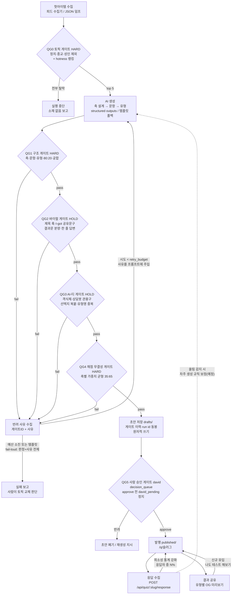

# 루프게이트 플로우차트 팩 — 주간 유형테스트 파이프라인

목표: **매번 바이럴 조건을 전부 갖추고, AI로 만든 티가 나지 않는 테스트만
발행되도록** 조건을 게이트로 성문화하고, 통과할 때까지 반려 사유를 피드백으로
재생성하는 루프를 돌린다.

> **정본은 선언식 팩 매니페스트다: [`src/quiz/pack.manifest.json`](../src/quiz/pack.manifest.json).**
> 게이트 등급·재시도 예산·제외 토픽·임계값·산출물 규약·no_go는 전부
> 매니페스트에서 로드되고(코드 상수 금지), 게이트 로직 자체는
> `src/quiz/gates.js`가 매니페스트를 해석해 실행한다. **이 문서는 파생 뷰 —
> 조건 값을 여기서 손편집하지 말 것.** 값 변경은 매니페스트에서 하고 이
> 문서에 반영한다.

> WRC 통합 상태 (2026-07-24 갱신): 검증된 세션 어댑터(`list_sessions` →
> `send_message`)로 WRC Workflow Gate 세션에 문의 3건을 전달했고 **정식
> ACK + 회신을 수신했다** (claude_workflow_gate, 2026-07-23). 회신에 따라
> 반영한 것: ① 선언식 매니페스트를 단일 진실원으로 추가 ② 게이트 ID를 팩
> 접두 `QG`로 리네임 ③ 게이트별 등급(HARD/HOLD/GUIDE) + risk_policy 선언
> ④ `runGates` 결과 봉투 고정(`{decision, reasons, gateResults}`) ⑤ 재시도
> 예산 매니페스트 이관 + 소진 시 fail-loud ⑥ 회차 결박 + 원자적 쓰기
> ⑦ `no_go: external_publish` 명문화. 잔여: 매니페스트 표준 정합 검토 1회,
> 운전석 전용 메뉴 등록.

**게이트 ID 마이그레이션**: `G0→QG0, G1→QG1, G2→QG2, G3→QG3, G4→QG4,
G5→QG5, G6→QG6` (WRC 컨벤션: 팩 접두 — 전 팩 공유 표면에서의 충돌 방지.
매니페스트 `gate_id_migration`이 기계 정본).

## 플로우차트



## 게이트 조건표 (파생 뷰 — 값의 정본은 매니페스트 `pack_contract.checks`)

| 게이트 | 등급 | 조건 (전부 충족해야 통과) | 실패 시 | 코드 |
|---|---|---|---|---|
| **QG0 토픽** | HARD | `excluded_topics`(정치·종교·성인) 제외, hotness 상위 N, 제목 중복 제거 | 소재 폐기, 전부 탈락 시 실행 중단 | `topics.js` |
| **QG1 구조** | HARD | 축 2~4개(극 코드 유일) · 문항 8~15개 · 축당 3문항+ · 문항당 1축 · 답변에 양극 혼합(정답 냄새/조작 방지) · 유형 = 극 조합 전체 커버 · 강점 3~5 + 성장 포인트 1~2(80:20) · 조언 1~3 · 궁합 상호 지정(자기 자신 금지) | 반려 → 재생성 피드백 | `generate.js` `validateQuiz` |
| **QG2 바이럴** | HOLD | 제목 8~40자(미리보기 훅) · 소개 20~90자 · 유형 서술 40자+(두 줄 결과문 금지) · 공유 문구에 "나는 ○○"(I-got) + 상대 호명 훅 · 답변 40자 이내(한 줄) | 반려 → 재생성 피드백 | `gates.js` QG2 |
| **QG3 AI-티** | HOLD | 격식체·상담봇 관용구 금지("물론입니다", "여러분", "하십시오"…) · 선택지 고유율 80%+(복붙 티 금지) · 유형 이름 중복 금지 | 반려 → 재생성 피드백 | `gates.js` QG3 |
| **QG4 채점 무결성** | HARD | 축별 선택지 가중치 좌:우 = 35:65 이내("다 이거 나오던데" 쏠림 방지) | 반려 → 재생성 피드백 | `gates.js` QG4 |
| **QG5 사람 승인** | kind: david | `publish quiz:` 작업이 `routeTask()`로 `decision_queue` 경유, `approve` 실행해야 발행. 재시도 없음(대기만), 우회 인자 없음 | 초안 유지(공개 경로 없음) | `store.js` `approve`, `router.js` |
| **QG6 발행 후 루프** | GUIDE | 실응답 누적 → 희소성 통계 강화(라플라스 스무딩) · 공유 유입 → 재참여 루프 | — (지속 피드백) | `store.js` stats, `render.js` |

등급 의미(매니페스트 `risk_tier_by_grade`): HARD 실패=**BLOCK**, HOLD
실패=**HOLD**, GUIDE 실패=**WARN**(advisory). QG3은 WRC 예상치(GUIDE)와
달리 HOLD로 선언 — "AI 티 제거"가 이 팩의 핵심 약속이라 발행 전 차단을
유지한다 (매니페스트 `gate_grades_note_ko`, 정합 검토 요청 항목).

## 결과 봉투 (하네스 계약)

`runGates(quiz)`는 WRC 하네스 계약의 구조화 봉투를 반환한다:

```js
{
  decision: "PASS" | "HOLD" | "BLOCK",   // 게이트 등급에서 파생
  reasons: ["[QG2-viral] …", …],          // [게이트ID] 접두 사유
  gateResults: [{ id, key, grade, pass, failures }, …],
  pass, failures                            // 기존 호출부 호환 별칭
}
```

진입점: `runGates(quiz)` (`src/quiz/gates.js`), `runWeekly(items, opts)`
(`src/quiz/weekly.js`).

## 루프 정책 (정본: 매니페스트 `retry_policy` · `run_binding`)

- **재시도 예산**: `retry_budget: 3` (매니페스트 선언 — 코드 상수 아님).
  매 실패 시 게이트별 반려 사유가 `[게이트ID] 사유` 형식으로 다음 프롬프트의
  "이전 생성 시도가 게이트에서 반려됐다 — 전부 해결하라" 섹션에 주입된다.
- **템플릿 폴백은 1회**: 결정적이라 재시도가 무의미 — 폴백이 게이트에
  걸리면 그건 코드 버그이고 테스트가 잡는다 (템플릿은 QG1~QG4 전 게이트
  통과가 테스트로 보장됨).
- **예산 소진 시 fail-loud**: 조용한 드롭 금지 — 판정(`decision`)과
  `[게이트ID]` 사유 전체를 에러에 실어 중단하고(`err.decision`,
  `err.reasons`), 사람이 토픽 교체를 판단한다.
- **회차 결박·멱등성**: run id = `<weekLabel>-<slug>`가 초안 메타에
  결박되고, 같은 회차·같은 콘텐츠 재실행은 동일 slug에 원자적
  쓰기(tmp→rename)로 수렴해 중복 산출이 없다.
- **감사 추적**: 초안 메타데이터에 게이트 이력(`gate.decision`,
  `gate.attempts`, 시도별 판정과 사유)이 남아 QG5 승인자가 "몇 번 만에,
  뭘 고쳐서 통과했는지"를 보고 판단할 수 있다.

## 조건의 근거

각 게이트 조건은 딥리서치로 도출된 명세([quiz-design.md](quiz-design.md))의
집행 장치다. 요약하면 — 두 줄 결과문·복붙 선택지·격식체는 "대충/AI 티"의
3대 사인(BuzzFeed 몰락 패턴), I-got 공유 문구와 궁합은 확산 계수의 핵심(국내
히트작 공통), 가중치 균형은 "다 이거 나오던데" 조작 티 방지, 80:20은 바넘
효과의 올바른 운용이다.
