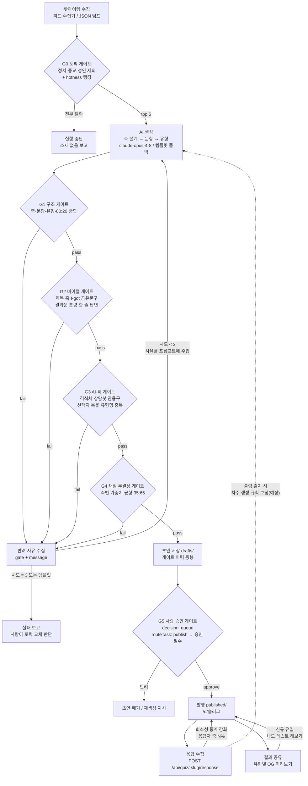

# 루프게이트 플로우차트 팩 — 주간 유형테스트 파이프라인

목표: **매번 바이럴 조건을 전부 갖추고, AI로 만든 티가 나지 않는 테스트만
발행되도록** 조건을 게이트로 성문화하고, 통과할 때까지 반려 사유를 피드백으로
재생성하는 루프를 돌린다. 게이트 정의의 단일 원본은 코드
(`src/quiz/gates.js`)이고, 이 문서는 그 플로우차트·조건표·루프 정책이다.

> WRC 통합 상태: 이 문서는 제품 레포의 후보 팩이며, WRC Workflow Gate 세션에
> 대한 검증된 전달·검수·ACK는 아직 완료되지 않았다.
> `create_trigger(persistent_session_id)`의 비활성은 세션 간 직접 통신 전체 금지를
> 뜻하지 않는다. PR 코멘트는 문서화 채널일 뿐 세션 수신 영수증이 아니다.
> WRC 표준 형식은 검증된 전달 경로에서 회신과 ACK를 받은 뒤 반영한다.

## 플로우차트

## 게이트 조건표

| 게이트 | 조건 (전부 충족해야 통과) | 실패 시 | 코드 |
|---|---|---|---|
| **G0 토픽** | 정치·종교·성인 태그 제외(기존 분류기), hotness 상위 5, 제목 중복 제거 | 소재 폐기, 전부 탈락 시 실행 중단 | `topics.js` |
| **G1 구조** | 축 2~4개(극 코드 유일) · 문항 8~15개 · 축당 3문항+ · 문항당 1축 · 답변에 양극 혼합(정답 냄새/조작 방지) · 유형 = 극 조합 전체 커버 · 강점 3~5 + 성장 포인트 1~2(80:20) · 조언 1~3 · 궁합 상호 지정(자기 자신 금지) | 반려 → 재생성 피드백 | `generate.js` `validateQuiz` |
| **G2 바이럴** | 제목 8~40자(미리보기 훅) · 소개 20~90자 · 유형 서술 40자+(두 줄 결과문 금지) · 공유 문구에 "나는 ○○"(I-got) + 상대 호명 훅 · 답변 40자 이내(한 줄) | 반려 → 재생성 피드백 | `gates.js` G2 |
| **G3 AI-티** | 격식체·상담봇 관용구 금지("물론입니다", "여러분", "하십시오"…) · 선택지 고유율 80%+(복붙 티 금지) · 유형 이름 중복 금지 | 반려 → 재생성 피드백 | `gates.js` G3 |
| **G4 채점 무결성** | 축별 선택지 가중치 좌:우 = 35:65 이내("다 이거 나오던데" 쏠림 방지) | 반려 → 재생성 피드백 | `gates.js` G4 |
| **G5 사람 승인** | `publish quiz:` 작업이 `routeTask()`로 `decision_queue` 경유, `approve` 실행해야 발행 | 초안 유지(공개 경로 없음) | `store.js` `approve`, `router.js` |
| **G6 발행 후 루프** | 실응답 누적 → 희소성 통계 강화(라플라스 스무딩) · 공유 유입 → 재참여 루프 | — (지속 피드백) | `store.js` stats, `render.js` |

## 루프 정책

- **재시도 예산**: 생성 3회 (`maxAttempts`, 조정 가능). 매 실패 시 게이트별
  반려 사유가 `[게이트ID] 사유` 형식으로 다음 프롬프트의
  "이전 생성 시도가 게이트에서 반려됐다 — 전부 해결하라" 섹션에 주입된다.
- **템플릿 폴백은 1회**: 결정적이라 재시도가 무의미 — 폴백이 게이트에
  걸리면 그건 코드 버그이고 테스트가 잡는다 (템플릿은 G1~G4 전 게이트 통과가
  테스트로 보장됨).
- **3회 소진 시**: 실패 사유 전체를 담아 에러로 중단 — 자동으로 억지 발행하지
  않고 사람이 토픽 교체를 판단한다.
- **감사 추적**: 초안 메타데이터에 게이트 이력(`gate.attempts`,
  시도별 pass/fail과 사유)이 남아 G5 승인자가 "몇 번 만에, 뭘 고쳐서
  통과했는지"를 보고 판단할 수 있다.

## 조건의 근거

각 게이트 조건은 딥리서치로 도출된 명세([quiz-design.md](quiz-design.md))의
집행 장치다. 요약하면 — 두 줄 결과문·복붙 선택지·격식체는 "대충/AI 티"의
3대 사인(BuzzFeed 몰락 패턴), I-got 공유 문구와 궁합은 확산 계수의 핵심(국내
히트작 공통), 가중치 균형은 "다 이거 나오던데" 조작 티 방지, 80:20은 바넘
효과의 올바른 운용이다.
