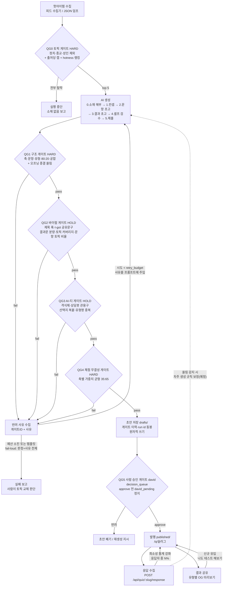

# 루프게이트 플로우차트 팩 — 주간 유형테스트 파이프라인

목표: **매번 바이럴 조건을 전부 갖추고, AI로 만든 티가 나지 않는 테스트만
발행되도록** 조건을 게이트로 성문화하고, 통과할 때까지 반려 사유를 피드백으로
재생성하는 루프를 돌린다.

> **정본은 선언식 팩 매니페스트다: [`src/quiz/pack.manifest.json`](../src/quiz/pack.manifest.json).**
> 게이트 등급·재시도 예산·제외 토픽·임계값·산출물 규약·no_go는 전부
> 매니페스트에서 로드되고(코드 상수 금지), 게이트 로직 자체는
> `src/quiz/gates.js`가 매니페스트를 해석해 실행한다. **이 문서는 파생 뷰 —
> 조건 값을 여기서 손편집하지 말 것.** 값 변경은 매니페스트에서 하고 이
> 문서에 반영한다.

> WRC 통합 상태 (2026-07-24 갱신): 검증된 세션 어댑터(`list_sessions` →
> `send_message`)로 WRC Workflow Gate 세션에 문의 3건을 전달했고 **정식
> ACK + 회신을 수신했다** (claude_workflow_gate, 2026-07-23). 회신에 따라
> 반영한 것: ① 선언식 매니페스트를 단일 진실원으로 추가 ② 게이트 ID를 팩
> 접두 `QG`로 리네임 ③ 게이트별 등급(HARD/HOLD/GUIDE) + risk_policy 선언
> ④ `runGates` 결과 봉투 고정(`{decision, reasons, gateResults}`) ⑤ 재시도
> 예산 매니페스트 이관 + 소진 시 fail-loud ⑥ 회차 결박 + 원자적 쓰기
> ⑦ `no_go: external_publish` 명문화. **정합 검토 결과 (2026-07-24):
> PASS_WITH_3_CORRECTIONS** — 의도적 편차 3건(QG3 HOLD·slug-키 스토어·json)
> 전부 수용, identity 패턴 교정 3건 반영 완료. **운전석 전용 메뉴 등록 완료**
> (wrc-workflow-gate `workflows/weekly_viral_quiz.yaml`, 라이브 확인
> `pack:weekly-viral-quiz`, activation `display_and_link_only` — 실행·산출물은
> 이 레포가 정본).

**게이트 ID 마이그레이션**: `G0→QG0, G1→QG1, G2→QG2, G3→QG3, G4→QG4,
G5→QG5, G6→QG6` (WRC 컨벤션: 팩 접두 — 전 팩 공유 표면에서의 충돌 방지.
매니페스트 `gate_id_migration`이 기계 정본).

> **생성 알고리즘 = 5단계 전문가 작업 절차** (0.소재 해부 → 1.컨셉 →
> 2.문항 초고 → 3.결과 초고 → 4.셀프 검수 → 5.제출, `buildPrompt()`가 단일
> 원본). 2차 적대 검수(전문가 5그룹+이용자 20명, 2026-07-25) 결론: "형식
> 게이트는 작동하지만 의미 층위가 샌다 + 생성이 한 방 출력이라 전문가가
> 만든 티가 안 난다" — 룰 나열식 프롬프트를 실제 제작자의 작업 절차로
> 재편해서, 소재-행동 짜깁기·오프닝 템플릿화·극 조언 수렴·상표 오남용 같은
> (코드 게이트가 형식적으로는 못 잡는) **의미 정합은 4단계 셀프 검수 +
> QG5 사람 판단이 담당**하고, 글자수·비율·유사도 같은 **형식 조건만 코드
> 게이트(QG0~QG4)가 담당**한다. 하드코딩 금지 원칙에 따라 이번 신규 검사도
> 값은 전부 매니페스트 `pack_contract.checks` 선언이다(코드 상수 없음).

## 플로우차트


```mermaid
flowchart TD
    A[핫아이템 수집<br/>피드 수집기 / JSON 덤프] --> G0{QG0 토픽 게이트 HARD<br/>정치·종교·성인 제외<br/>+ 출처당 캡 + hotness 랭킹}
    G0 -- 전부 탈락 --> X0[실행 중단<br/>소재 없음 보고]
    G0 -- top 5 --> GEN[AI 생성<br/>0.소재 해부 → 1.컨셉 → 2.문항 초고<br/>→ 3.결과 초고 → 4.셀프 검수 → 5.제출]

    GEN --> G1{QG1 구조 게이트 HARD<br/>축·문항·유형·80:20·궁합<br/>+ 오프닝 종결 쏠림}
    G1 -- fail --> FB[반려 사유 수집<br/>게이트ID + 사유]
    G1 -- pass --> G2{QG2 바이럴 게이트 HOLD<br/>제목 훅·I-got 공유문구<br/>결과문 분량·토픽 커버리지·문항 토픽 비율}
    G2 -- fail --> FB
    G2 -- pass --> G3{QG3 AI-티 게이트 HOLD<br/>격식체·상담봇 관용구<br/>선택지 복붙·유형명 중복}
    G3 -- fail --> FB
    G3 -- pass --> G4{QG4 채점 무결성 게이트 HARD<br/>축별 가중치 균형 35:65}
    G4 -- fail --> FB
    G4 -- pass --> DRAFT[초안 저장 drafts/<br/>게이트 이력·run id 동봉<br/>원자적 쓰기]

    FB -- "시도 < retry_budget<br/>사유를 프롬프트에 주입" --> GEN
    FB -- "예산 소진 또는 템플릿<br/>fail-loud: 판정+사유 전체" --> X1[실패 보고<br/>사람이 토픽 교체 판단]

    DRAFT --> G5{QG5 사람 승인 게이트 david<br/>decision_queue<br/>approve 전 david_pending 정지}
    G5 -- 반려 --> X2[초안 폐기 / 재생성 지시]
    G5 -- approve --> PUB[발행 published/<br/>/q/슬러그]

    PUB --> RESP[응답 수집<br/>POST /api/quiz/:slug/response]
    RESP -- "희소성 통계 강화<br/>응답자 중 N%" --> PUB
    PUB --> SHARE[결과 공유<br/>유형별 OG 미리보기]
    SHARE -- "신규 유입<br/>나도 테스트 해보기" --> PUB
    RESP -. "쏠림 감지 시<br/>차주 생성 규칙 보정(예정)" .-> GEN
```

## 게이트 조건표 (파생 뷰 — 값의 정본은 매니페스트 `pack_contract.checks`)

| 게이트 | 등급 | 조건 (전부 충족해야 통과) | 실패 시 | 코드 |
|---|---|---|---|---|
| **QG0 토픽** | HARD | `excluded_topics`(정치·종교·성인) 제외 · `topic_safety`(연예인 사생활·재난공포 키워드 제목 매칭) 제외 · **출처(source)당 최대 `max_per_source`개 캡(후보 부족 시에만 캡 초과 허용해 개수 보장 — 실패 대신 채움, 2차 검수: theqoo 단일 출처 편중 해소)** · hotness 상위 N · 제목 중복 제거 | 소재 폐기, 전부 탈락 시 실행 중단 | `topics.js` |
| **QG1 구조** | HARD | 축 2~4개(극 코드 유일) · 문항 8~15개 · 축당 3문항+ · 문항당 1축 · 답변에 양극 혼합(정답 냄새/조작 방지) · 유형 = 극 조합 전체 커버 · 강점 3~5 + 성장 포인트 1~2(80:20) · 조언 1~3 · 궁합 상호 지정(자기 자신 금지) · **궁합 이유(bestMatchReason/worstMatchReason) 비어있지 않음 + 40자 이내** · **문항별 답변 개수 통일** · **문항 쌍별 유사도 ≤ `question_similarity_max`(같은 소재/문장 재탕 금지)** · **축별 1번 답 pole 혼합(역채점 균형, 전부 같은 극이면 반려)** · **결과 서술 오프닝 종결 최빈 패턴 비율 ≤ `opening_pattern_max_ratio`(2차 검수: "~게 너다" 8/8 템플릿 티 방지)** | 반려 → 재생성 피드백 | `generate.js` `validateQuiz`, `gates.js` QG1 |
| **QG2 바이럴** | HOLD | 제목 8~40자(미리보기 훅) · 소개 20~90자 · 유형 서술 40자 이상 `result_desc_chars_max`(220자) 이하 · 공유 문구에 "나는 ○○"(I-got) + 상대 호명 훅 · 공유 문구 `share_text_chars_max`(60자) 이내 · 답변 40자 이내(한 줄) · **(topics 컨텍스트 있을 때) 제목+소개에 이번 주 토픽 어절 최소 1개** · **(topics 컨텍스트 있을 때) 각 결과 서술에 토픽 어절 최소 1개(유형 code 명시)** · **(topics 컨텍스트 있을 때) 결과 서술 전체의 토픽 커버리지 ≥ min(토픽 수, 유형 수) — 미달 시 빠진 토픽 명시(2차 검수: 한두 토픽만 우려먹지 않게)** · **(topics 컨텍스트 있을 때) 문항 토픽 파생 비율 ≥ `question_topic_bound_min_ratio`(범용 필러 최소화)** · **공유 문구 쌍별 유사도 ≤ `share_text_similarity_max`(템플릿 복붙 금지)** · **공유 문구 물음표 종결 비율 ≤ `share_text_question_ending_max_ratio`(반문형 일색 금지 — 감탄·선언·도발형 혼합)** | 반려 → 재생성 피드백 | `gates.js` QG2 |
| **QG3 AI-티** | HOLD | 격식체·상담봇 관용구 금지("물론입니다", "여러분", "하십시오", "~합니다/습니다/입니다/됩니다/드립니다", "~하세요/해보세요", "습관 들이기"…) · 선택지 고유율 80%+(복붙 티 금지) · 유형 이름 중복 금지 | 반려 → 재생성 피드백 | `gates.js` QG3 |
| **QG4 채점 무결성** | HARD | 축별 선택지 가중치 좌:우 = 35:65 이내("다 이거 나오던데" 쏠림 방지) | 반려 → 재생성 피드백 | `gates.js` QG4 |
| **QG5 사람 승인** | kind: david | `publish quiz:` 작업이 `routeTask()`로 `decision_queue` 경유, `approve` 실행해야 발행. 재시도 없음(대기만), 우회 인자 없음 | 초안 유지(공개 경로 없음) | `store.js` `approve`, `router.js` |
| **QG6 발행 후 루프** | GUIDE | 실응답 누적 → 희소성 통계 강화(라플라스 스무딩) · 공유 유입 → 재참여 루프 | — (지속 피드백) | `store.js` stats, `render.js` |

**상표 정책 (게이트 검사 없음, note로만 선언)**: 매니페스트
`topic_safety.trademark_policy_ko` — 토픽 제목에 이미 등장한 상표명은 공개
화제 인용으로 그대로 써도 되고, 토픽에 없는 상표는 일반 명사로 우회한다.
자동 검사가 불가능한 판단이라 4단계 셀프 검수 + QG5 사람 판단에 맡기고,
코드로 강제하지 않는다는 사실을 정직하게 note로만 남긴다.

발행 산출물에는 랜딩 커버 카드(`/q/<slug>/og/cover.png`)가 포함된다 — `approve` 직후부터
발행된 슬러그에 대해 서버가 즉시 렌더링해 서빙하는 파생 자산이며(`ogcard.js`/`ogrender.js`,
`GET /q/<slug>/og/cover.png`), 퀴즈 랜딩(`/q/<slug>`)의 `og:image`가 이 경로를 가리킨다.

등급 의미(매니페스트 `risk_tier_by_grade`): HARD 실패=**BLOCK**, HOLD
실패=**HOLD**, GUIDE 실패=**WARN**(advisory). QG3은 WRC 예상치(GUIDE)와
달리 HOLD로 선언 — "AI 티 제거"가 이 팩의 핵심 약속이라 발행 전 차단을
유지한다 (매니페스트 `gate_grades_note_ko`, 정합 검토 요청 항목).

## 결과 봉투 (하네스 계약)

`runGates(quiz)`는 WRC 하네스 계약의 구조화 봉투를 반환한다:

```js
{
  decision: "PASS" | "HOLD" | "BLOCK",   // 게이트 등급에서 파생
  reasons: ["[QG2-viral] …", …],          // [게이트ID] 접두 사유
  gateResults: [{ id, key, grade, pass, failures }, …],
  pass, failures                            // 기존 호출부 호환 별칭
}
```

진입점: `runGates(quiz)` (`src/quiz/gates.js`), `runWeekly(items, opts)`
(`src/quiz/weekly.js`).

## 루프 정책 (정본: 매니페스트 `retry_policy` · `run_binding`)

- **재시도 예산**: `retry_budget: 3` (매니페스트 선언 — 코드 상수 아님).
  매 실패 시 게이트별 반려 사유가 `[게이트ID] 사유` 형식으로 다음 프롬프트의
  "이전 생성 시도가 게이트에서 반려됐다 — 전부 해결하라" 섹션에 주입된다.
- **템플릿 폴백은 1회**: 결정적이라 재시도가 무의미 — 폴백이 게이트에
  걸리면 그건 코드 버그이고 테스트가 잡는다 (템플릿은 QG1~QG4 전 게이트
  통과가 테스트로 보장됨).
- **예산 소진 시 fail-loud**: 조용한 드롭 금지 — 판정(`decision`)과
  `[게이트ID]` 사유 전체를 에러에 실어 중단하고(`err.decision`,
  `err.reasons`), 사람이 토픽 교체를 판단한다.
- **회차 결박·멱등성**: run id = `<weekLabel>-<slug>`가 초안 메타에
  결박되고, 같은 회차·같은 콘텐츠 재실행은 동일 slug에 원자적
  쓰기(tmp→rename)로 수렴해 중복 산출이 없다.
- **감사 추적**: 초안 메타데이터에 게이트 이력(`gate.decision`,
  `gate.attempts`, 시도별 판정과 사유)이 남아 QG5 승인자가 "몇 번 만에,
  뭘 고쳐서 통과했는지"를 보고 판단할 수 있다.

## 조건의 근거

각 게이트 조건은 딥리서치로 도출된 명세([quiz-design.md](quiz-design.md))의
집행 장치다. 요약하면 — 두 줄 결과문·복붙 선택지·격식체는 "대충/AI 티"의
3대 사인(BuzzFeed 몰락 패턴), I-got 공유 문구와 궁합은 확산 계수의 핵심(국내
히트작 공통), 가중치 균형은 "다 이거 나오던데" 조작 티 방지, 80:20은 바넘
효과의 올바른 운용이다.

2026-07-25 8팀 적대 검수 반영.
2026-07-25 2차 검수(전문가 5그룹+이용자 20명) 반영: 생성 알고리즘을 5단계
전문가 절차로 재설계 + QG0 출처 캡 · QG1 오프닝 종결 쏠림 · QG2 결과 전체
토픽 커버리지/문항 토픽 비율/공유 문구 물음표 비율 · 궁합 이유
(bestMatchReason/worstMatchReason) 신설.
