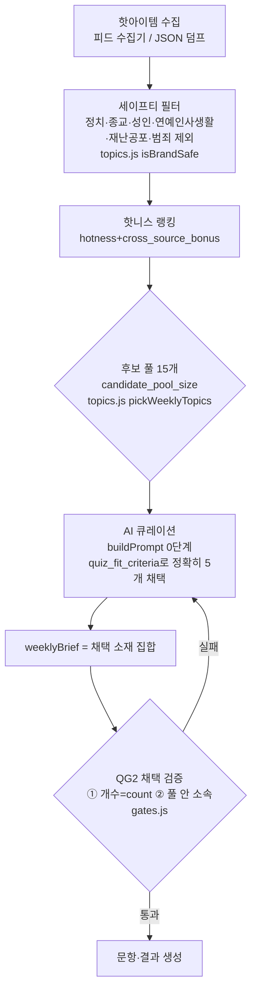

# 주제선정 알고리즘 해설 (David용) — 역사적 문서(superseded)

> **2026-07-26 David 방향 정정: 테마=주인, 수집=유행 테스트 신호 탐지.**
> 이 문서 본문이 설명하는 "hotness 후보 풀 → buildPrompt 0단계에서 5개
> 채택" 파이프라인은 **폐기됐다.** David의 최종 방향은 이보다 근본적이다 —
> "테스트 하나 = 성향 하나"가 주인이고, 핫토픽 잡탕(여러 화제를 섞은 문항)은
> 애초에 잘못된 방향이었다. 지금은 **테마(성향 하나)를 매니페스트
> `pack_contract.theme.pool`에서 직접 고르고**, 핫아이템 수집 파이프라인은
> 소재 채택용이 아니라 "요즘 어떤 테스트 유형이 도는지" 참고 신호
> (`topics.js pickTestTrendSignals`, `pack_contract.trend_signal_*`)로만
> 쓰인다. 아래 본문(후보 풀·quiz_fit_criteria·QG2 채택 검증)은 이전 세대
> (매니페스트 version 5)의 설계로 **역사적 참고용으로만 남긴다** — 최신
> 파이프라인은 [`docs/quiz-loopgate.md`](quiz-loopgate.md)와
> [`docs/quiz-cron.md`](quiz-cron.md)가 정본이다.

David 실사용 피드백(2026-07-26): "주제 자체가 별로다." — 기계가 hotness
랭킹으로 뽑은 소재를 그대로 퀴즈에 썼더니, 화제성은 높아도 퀴즈감(자기투영·
성향 갈림)이 없는 소재가 섞여 나왔다. 이 문서는 (당시) 개편된 파이프라인을
설명한다. 그 개편조차 "소재를 잘 고르면 된다"는 전제가 틀렸다는 게 이후
David의 결론이다 — 소재가 아니라 테마(성향)가 애초에 주인이어야 했다.

> 정본은 [`src/quiz/pack.manifest.json`](../src/quiz/pack.manifest.json)
> (version 6)이다. 이 문서는 파생 뷰이자 이제는 이전 세대(version 5) 설계의
> 기록 — 손잡이 값은 매니페스트에서 바꾸고 이 문서에 반영한다.

## 핵심 변화: 기계 선정 → 후보 풀, 최종 선정 → 생성자

**이전(version 4까지)**: hotness 랭킹 상위 5개 = 그 주 퀴즈 소재 그대로.
기계가 최종 결정권자.

**이후(version 5, 2026-07-26)**: hotness 랭킹은 15개(`candidate_pool_size`)
후보 풀만 추린다. 그 15개 중 실제로 퀴즈에 쓸 5개(`checks.topics.count`)는
**생성자(Claude Code 세션, buildPrompt [0단계])가 quiz_fit_criteria로 직접
채택**한다. 기계 선정은 안전·대중성 필터로 지위가 낮아졌고, "이게 퀴즈가
될 소재인가"라는 마지막 판단은 사람 작업 절차를 흉내 낸 생성자가 한다.

## 파이프라인

- **세이프티 필터**(`topics.js isBrandSafe`): `excluded_topics`(정치/종교/성인)
  + `topic_safety` 키워드(연예인 사생활·재난공포·범죄/스캔들·정치 보강) +
  한글 최소 글자수(`hangul_chars_min`).
- **핫니스 랭킹**: `hotness()`(공개 참여 신호만) + `cross_source_bonus`(여러
  커뮤니티 동시 화제 가산점), `max_per_source`/`max_single_source_topics`로
  단일 출처·단일 커뮤 내수 편중을 캡.
- **후보 풀 15개**(`candidate_pool_size`): 여기까지가 기계의 역할 — 세이프
  하고 화제성 있는 15개를 추릴 뿐, 어느 게 좋은 퀴즈감인지는 판단하지 않는다.
- **AI 큐레이션**: `buildPrompt()`의 [0단계]가 15개 후보 목록을 그대로 프롬프트에
  주고, `quiz_fit_criteria_ko` 4개 기준으로 정확히 5개를 채택하라고 지시한다.
  화제성 순위가 1위라도 퀴즈감이 없으면 버리고, 순위가 낮아도 퀴즈감이 있으면
  채택하는 게 이 단계의 존재 이유다.
- **채택 검증**(`gates.js` QG2): 생성된 퀴즈의 `weeklyBrief`가 곧 "채택 소재"
  선언이다 — ① `weeklyBrief.length`가 채택 개수와 정확히 같은지 ② 각
  `weeklyBrief[].topic`이 15개 후보 풀 중 하나와 토큰이 겹치는지(겹치지
  않으면 "풀 밖 소재 발명"으로 반려) 검증한다. 이후 제목·문항·결과 커버리지
  검사는 전체 풀이 아니라 이 채택 소재 5개를 기준으로 한다.

## 퀴즈감 채택 기준 (quiz_fit_criteria_ko)

매니페스트 `pack_contract.checks.topics.quiz_fit_criteria_ko`에 선언된 4가지
(코드에 하드코딩하지 않음 — 프롬프트가 이 배열을 그대로 읽어 나열한다):

1. **자기투영** — 읽는 사람이 "내 얘기"로 만들 수 있는 소재
2. **성향 갈림** — 사람마다 반응이 갈리는 소재 (사실 전달형 뉴스는 탈락)
3. **감정·취향 자극** — 웃음, 로망, 공감, 논쟁 없는 취향 대립
4. **설명 부담** — 한 줄 설명으로 이해 가능한 소재 우선

## 손잡이별 매니페스트 위치

| 손잡이 | 위치 | 현재값 |
|---|---|---|
| 후보 풀 크기 | `pack_contract.checks.topics.candidate_pool_size` | 15 |
| 최종 채택 개수 | `pack_contract.checks.topics.count` | 5 |
| 퀴즈감 채택 기준 | `pack_contract.checks.topics.quiz_fit_criteria_ko` | 4개 항목 |
| 세이프티 키워드 | `pack_contract.checks.topic_safety.*` | 연예인사생활/재난공포/범죄스캔들/정치보강 |
| 대중성 가산점 | `pack_contract.checks.topics.cross_source_bonus` | 0.5 |
| 단일 커뮤 캡 | `pack_contract.checks.topics.max_single_source_topics` | 2 |
| 출처당 캡 | `pack_contract.checks.topics.max_per_source` | 2 |
| 한글 최소 글자수 | `pack_contract.checks.topics.hangul_chars_min` | 4 |

## 각 단계가 걸러낸 실사례

이 표는 "왜 이 소재가 퀴즈에 안 들어갔는가"를 단계별로 보여준다 —
`docs/quiz-hit-corpus-research.md`·기존 검수 이력에서 실제로 등장한 사례:

| 실사례(제목 예시) | 걸린 단계 | 이유 |
|---|---|---|
| "제니 카이 이민호 열애설 스킨십 포착" | 세이프티 필터 | `topic_safety.celebrity_private_life`("열애") — 실존인물 사생활은 광고 지면 정책 리스크 |
| "성매매 시의원 급여 챙겨감" | 세이프티 필터 | `topic_safety.crime_scandal`("성매매") — 범죄·스캔들 소재 제외 |
| "유시민 당대표는 대통령 부하 아냐 발언" | 세이프티 필터 | `topic_safety.politics_extra`("유시민") — 기존 정치 분류기가 못 잡는 정치 소재 보강 |
| "Startup founders urge U.S. government…" (hackernews) | 세이프티 필터 | `hangul_chars_min` 미달 — 한글 4자 미만(영문 제목) |
| "중국산 생수 안전성 논란" 류 사실전달형 뉴스 | AI 큐레이션(대상은 되지만 채택 안 됨) | 세이프티는 통과(정치/범죄 아님)하고 후보 풀엔 들어가지만, quiz_fit_criteria의 "성향 갈림"(사실 전달형 뉴스는 탈락) 기준에서 생성자가 채택하지 않음 — 이게 이번 개편의 핵심 사례: 화제성은 있어도 "논쟁 없는 취향 대립"이 아니라 사실 보도라 퀴즈감이 없다 |

## 조정 방법

1. **후보 풀을 넓히거나 좁히려면**: `candidate_pool_size` 값을 바꾼다(현재
   15). 값을 올리면 생성자가 고를 선택지가 늘지만 프롬프트 길이도 늘어난다.
2. **최종 채택 개수를 바꾸려면**: `checks.topics.count`를 바꾼다. 이 값은
   `templateQuiz`(폴백 경로)가 풀 앞에서 몇 개를 자동 채택할지, `gates.js`
   QG2가 `weeklyBrief` 길이를 몇 개로 강제할지, `generation.axes_count`와
   무관하게 결과 유형 수 커버리지 계산에도 쓰인다.
3. **채택 기준 자체를 바꾸려면**: `quiz_fit_criteria_ko` 배열 항목을 수정한다
   — `buildPrompt()`가 이 배열을 그대로 프롬프트에 나열하므로 코드 수정
   없이 문구만 바꾸면 다음 생성부터 반영된다.
4. **세이프티가 과도하게/부족하게 거른다면**: `topic_safety.*` 키워드 배열을
   수정한다(국소 수정 원칙 — 반려/규칙은 문언 그대로 해당 부분만 고친다).
5. **모든 조정은 매니페스트에서만** — `topics.js`/`generate.js`/`gates.js`에
   값을 하드코딩하지 않는다(소프트코딩 매니페스트 원칙).

## 관련 문서

- [`docs/quiz-loopgate.md`](quiz-loopgate.md) — 루프게이트(QG0~QG6) 조건표
- [`docs/quiz-cron.md`](quiz-cron.md) — 예약 세션이 후보 풀→큐레이션을
  실행하는 절차
- [`docs/quiz-design.md`](quiz-design.md) — 설계 스펙 전체
- [`docs/quiz-hit-corpus-research.md`](quiz-hit-corpus-research.md) — 이번
  개편의 리서치 근거(R1~R7 제안)
